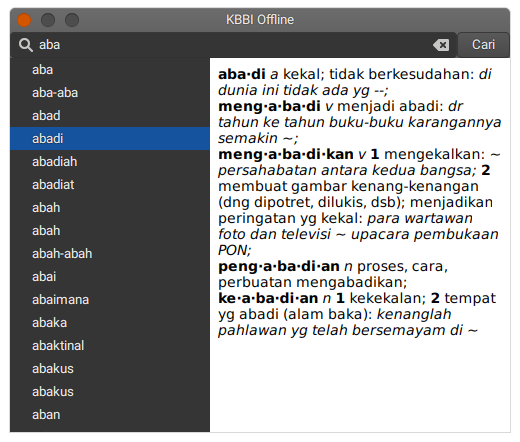

# KBBI GTK

KBBI offline remake with GTK3.

This is my hobby project to learn more about C programming, widget programming using GTK, and dynamic library. Feel free to explore, fork, or create a pull request if you interested.



## Todo

- [ ] Unit testing with CMake (?)

## Building

```sh
# Create build directory
$ mkdir -p build
$ cd build

# Run cmake to generate build files
$ cmake ..

# Run make to start building
$ make

# Optional: run install script to install the apps
$ sudo make install

# Optional: run uninstall script to uninstall the apps
$ sudo make uninstall

```
